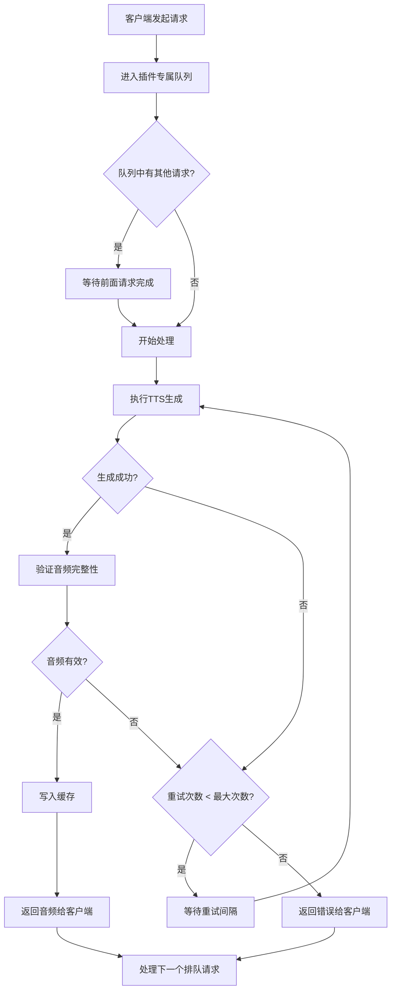

# TTS请求队列与重试机制重构计划

## 1. 概述

### 1.1 背景
当前TTS API采用无队列的并发处理模式，多个请求可能同时执行TTS生成，这可能导致：
- 上游服务（TTS插件/引擎）负载过高
- 请求失败时没有自动重试机制
- 并发请求可能相互干扰

### 1.2 目标
- **按插件排队**：每个插件维护独立的请求队列，同一插件同一时间只处理一个请求
- **错误重试**：向上游请求失败时自动重试，重试次数和间隔可配置
- **保持连接**：客户端请求期间保持HTTP连接，在队列等待和重试期间不断开
- **完全完成**：只有请求完全成功（音频生成完整）后才返回客户端

### 1.3 工作流程



## 2. 技术设计

### 2.1 新增模块：队列管理器

创建新文件 [`lib/queue-manager.ts`](lib/queue-manager.ts) 实现按插件分别排队的逻辑。

```typescript
// 队列管理器设计
interface QueuedRequest {
  id: string;                    // 请求唯一ID
  params: TTSParams;             // TTS参数
  resolve: (result: any) => void;
  reject: (error: Error) => void;
  addedAt: number;               // 入队时间戳
}

class PluginQueueManager {
  // 每个插件ID对应一个请求队列
  private queues: Map<string, QueuedRequest[]>;
  
  // 每个插件的处理状态
  private processing: Map<string, boolean>;
  
  // 添加请求到队列
  enqueue(pluginId: string, params: TTSParams): Promise<TTSResult>;
  
  // 处理队列中的下一个请求
  private processNext(pluginId: string): Promise<void>;
  
  // 获取队列状态（用于调试/监控）
  getQueueStatus(): Record<string, number>;
}
```

**设计要点：**
- 使用 `Map<pluginId, QueuedRequest[]>` 为每个插件维护独立队列
- 使用 Promise 让请求在队列中等待，HTTP连接保持打开
- 单例模式确保全局只有一个队列管理器实例
- 请求完成后自动触发下一个请求的处理

### 2.2 重试机制

在 [`lib/services/tts.service.ts`](lib/services/tts.service.ts) 中实现重试逻辑：

```typescript
// 带重试的TTS生成函数
async function generateWithRetry(
  params: TTSParams,
  retryConfig: RetryConfig
): Promise<TTSSuccessResult> {
  let lastError: Error;
  
  for (let attempt = 1; attempt <= retryConfig.maxRetries; attempt++) {
    try {
      const result = await executeGeneration(params);
      
      // 验证音频完整性
      if (isValidAudio(result.audio)) {
        return result;
      }
      throw new Error('生成的音频无效或不完整');
      
    } catch (error) {
      lastError = error;
      logger.warn(`TTS生成失败，第${attempt}次尝试: ${error.message}`);
      
      if (attempt < retryConfig.maxRetries) {
        await sleep(retryConfig.retryInterval);
      }
    }
  }
  
  throw new Error(`TTS生成失败，已重试${retryConfig.maxRetries}次: ${lastError.message}`);
}

// 验证音频是否有效
function isValidAudio(audio: ArrayBuffer): boolean {
  // 检查音频大小
  if (!audio || audio.byteLength === 0) return false;
  
  // 可选：检查音频文件头（魔数）
  const header = new Uint8Array(audio.slice(0, 4));
  // MP3: 0xFF 0xFB 或 ID3 标签
  // 其他格式的检查...
  
  return true;
}
```

### 2.3 配置系统更新

修改 [`lib/config.ts`](lib/config.ts:19) 添加重试相关配置：

```typescript
export const config = {
  // ... 现有配置
  
  // 重试相关配置
  retry: {
    // 最大重试次数（默认10次）
    maxRetries: getEnvNumber('TTS_MAX_RETRIES', 10),
    // 重试间隔（毫秒，默认5000ms = 5秒）
    retryIntervalMs: getEnvNumber('TTS_RETRY_INTERVAL_MS', 5000),
  },
  
  // 队列相关配置
  queue: {
    // 请求在队列中的最大等待时间（毫秒，默认5分钟）
    maxWaitTimeMs: getEnvNumber('QUEUE_MAX_WAIT_MS', 300000),
  },
};
```

### 2.4 数据库配置存储

在 `system-config` 中添加重试配置，修改 [`app/settings/page.tsx`](app/settings/page.tsx:22) 添加UI控件：

```typescript
// 系统配置接口扩展
interface SystemConfig {
  cacheEnabled: boolean;
  logLevel: string;
  // 新增
  retryMaxCount: number;      // 错误重试次数
  retryIntervalSeconds: number; // 错误重试间隔（秒）
}
```

## 3. 文件修改清单

### 3.1 新增文件

| 文件路径 | 说明 |
|---------|------|
| `lib/queue-manager.ts` | 按插件分别排队的队列管理器 |

### 3.2 修改文件

| 文件路径 | 修改内容 |
|---------|---------|
| [`lib/config.ts`](lib/config.ts) | 添加重试和队列相关默认配置 |
| [`lib/services/tts.service.ts`](lib/services/tts.service.ts) | 集成队列管理器和重试逻辑 |
| [`app/api/tts/route.ts`](app/api/tts/route.ts) | 调用新的队列化TTS服务 |
| [`app/settings/page.tsx`](app/settings/page.tsx) | 添加重试配置的UI控件 |
| [`types/index.ts`](types/index.ts) | 添加新的类型定义 |

## 4. 详细实现步骤

### 步骤1: 创建队列管理器模块

创建 `lib/queue-manager.ts`：

```typescript
import { logger } from './logger';
import { config } from './config';

interface QueuedRequest<T> {
  id: string;
  pluginId: string;
  execute: () => Promise<T>;
  resolve: (value: T) => void;
  reject: (reason: Error) => void;
  enqueuedAt: number;
}

class PluginQueueManager {
  private static instance: PluginQueueManager;
  private queues = new Map<string, QueuedRequest<any>[]>();
  private processing = new Map<string, boolean>();

  private constructor() {}

  static getInstance(): PluginQueueManager {
    if (!PluginQueueManager.instance) {
      PluginQueueManager.instance = new PluginQueueManager();
    }
    return PluginQueueManager.instance;
  }

  async enqueue<T>(pluginId: string, execute: () => Promise<T>): Promise<T> {
    return new Promise((resolve, reject) => {
      const request: QueuedRequest<T> = {
        id: crypto.randomUUID(),
        pluginId,
        execute,
        resolve,
        reject,
        enqueuedAt: Date.now(),
      };

      // 获取或创建该插件的队列
      if (!this.queues.has(pluginId)) {
        this.queues.set(pluginId, []);
      }
      
      const queue = this.queues.get(pluginId)!;
      queue.push(request);
      
      logger.debug(`请求 ${request.id} 已加入插件 ${pluginId} 队列，当前队列长度: ${queue.length}`);

      // 如果当前没有在处理，开始处理
      if (!this.processing.get(pluginId)) {
        this.processNext(pluginId);
      }
    });
  }

  private async processNext(pluginId: string): Promise<void> {
    const queue = this.queues.get(pluginId);
    if (!queue || queue.length === 0) {
      this.processing.set(pluginId, false);
      return;
    }

    this.processing.set(pluginId, true);
    const request = queue.shift()!;

    // 检查是否超时
    const waitTime = Date.now() - request.enqueuedAt;
    if (waitTime > config.queue.maxWaitTimeMs) {
      request.reject(new Error(`请求在队列中等待超时 (${waitTime}ms)`));
      this.processNext(pluginId);
      return;
    }

    logger.info(`开始处理插件 ${pluginId} 的请求 ${request.id}`);

    try {
      const result = await request.execute();
      request.resolve(result);
    } catch (error) {
      request.reject(error as Error);
    } finally {
      // 处理下一个请求
      this.processNext(pluginId);
    }
  }

  getQueueStatus(): Record<string, { queueLength: number; isProcessing: boolean }> {
    const status: Record<string, { queueLength: number; isProcessing: boolean }> = {};
    for (const [pluginId, queue] of this.queues) {
      status[pluginId] = {
        queueLength: queue.length,
        isProcessing: this.processing.get(pluginId) || false,
      };
    }
    return status;
  }
}

export const queueManager = PluginQueueManager.getInstance();
```

### 步骤2: 修改TTS服务层

修改 [`lib/services/tts.service.ts`](lib/services/tts.service.ts:91) 的 `generateSpeech` 函数：

```typescript
import { queueManager } from '@/lib/queue-manager';

// 获取重试配置
async function getRetryConfig(): Promise<{ maxRetries: number; retryIntervalMs: number }> {
  try {
    const systemConfig = await getSystemConfig();
    return {
      maxRetries: systemConfig.retryMaxCount ?? config.retry.maxRetries,
      retryIntervalMs: (systemConfig.retryIntervalSeconds ?? config.retry.retryIntervalMs / 1000) * 1000,
    };
  } catch {
    return {
      maxRetries: config.retry.maxRetries,
      retryIntervalMs: config.retry.retryIntervalMs,
    };
  }
}

// 带重试的核心生成逻辑
async function executeWithRetry(
  plugin: Plugin,
  params: ProcessedParams,
  retryConfig: { maxRetries: number; retryIntervalMs: number }
): Promise<Buffer> {
  let lastError: Error = new Error('Unknown error');

  for (let attempt = 1; attempt <= retryConfig.maxRetries; attempt++) {
    try {
      const result = await runPluginInWorker({
        task: 'getAudio',
        code: plugin.code,
        config: params.runtimeConfig,
        text: params.text,
        locale: params.locale,
        voice: params.voice,
        speed: params.speed,
        volume: params.volume,
        pitch: params.pitch,
        debug: false,
      });

      if (!result.success) {
        throw new Error(result.error?.message || 'Worker returned an error');
      }

      const audioBuffer = Buffer.from(result.audioBuffer);
      
      // 验证音频有效性
      if (!audioBuffer || audioBuffer.length === 0) {
        throw new Error('生成的音频为空');
      }

      logger.info(`TTS生成成功，第${attempt}次尝试`);
      return audioBuffer;

    } catch (error: any) {
      lastError = error;
      logger.warn(`TTS生成失败，第${attempt}/${retryConfig.maxRetries}次尝试: ${error.message}`);

      if (attempt < retryConfig.maxRetries) {
        logger.info(`等待 ${retryConfig.retryIntervalMs}ms 后重试...`);
        await new Promise(resolve => setTimeout(resolve, retryConfig.retryIntervalMs));
      }
    }
  }

  throw new PluginError(`TTS生成失败，已重试${retryConfig.maxRetries}次: ${lastError.message}`);
}

// 主入口函数重构
export async function generateSpeech(params: TTSParams): Promise<TTSSuccessResult | TTSDebugResult> {
  // 调试模式不使用队列和重试
  if (params.debug) {
    return generateSpeechDirect(params);
  }

  // 获取 pluginId（可能需要从默认配置获取）
  const pluginId = await resolvePluginId(params);

  // 将请求加入对应插件的队列
  return queueManager.enqueue(pluginId, async () => {
    return generateSpeechDirect(params);
  });
}

// 直接生成逻辑（供队列调用）
async function generateSpeechDirect(params: TTSParams): Promise<TTSSuccessResult | TTSDebugResult> {
  // ... 现有的 generateSpeech 逻辑，但替换 worker 调用部分为 executeWithRetry
}
```

### 步骤3: 更新配置文件

修改 [`lib/config.ts`](lib/config.ts:19)：

```typescript
export const config = {
  worker: {
    timeoutMs: getEnvNumber('WORKER_TIMEOUT_MS', 15000),
    resourceLimits: {
      maxOldGenerationSizeMb: getEnvNumber('WORKER_MAX_OLD_GEN_MB', 512),
      maxYoungGenerationSizeMb: getEnvNumber('WORKER_MAX_YOUNG_GEN_MB', 128),
      codeRangeSizeMb: getEnvNumber('WORKER_CODE_RANGE_MB', 64),
    },
  },

  cache: {
    cleanupProbability: getEnvNumber('CACHE_CLEANUP_PROBABILITY', 0.01),
    ttlMs: getEnvNumber('CACHE_TTL_MS', 24 * 60 * 60 * 1000),
  },

  // 新增：重试配置
  retry: {
    maxRetries: getEnvNumber('TTS_MAX_RETRIES', 10),
    retryIntervalMs: getEnvNumber('TTS_RETRY_INTERVAL_MS', 5000),
  },

  // 新增：队列配置
  queue: {
    maxWaitTimeMs: getEnvNumber('QUEUE_MAX_WAIT_MS', 300000), // 5分钟
  },
};
```

### 步骤4: 更新设置页面UI

修改 [`app/settings/page.tsx`](app/settings/page.tsx:171)，在系统选项卡片中添加重试配置：

```tsx
{/* 系统选项卡片 */}
<Card>
  <Title level={4} style={{ marginBottom: 16 }}>系统选项</Title>
  <Form
    form={systemForm}
    layout="vertical"
    onFinish={onSystemFinish}
    initialValues={{
      cacheEnabled: true,
      logLevel: 'INFO',
      retryMaxCount: 10,
      retryIntervalSeconds: 5,
    }}
  >
    <Row gutter={24}>
      {/* 现有的缓存开关和日志等级 */}
      <Col span={12}>
        <Form.Item
          label="启用缓存"
          name="cacheEnabled"
          valuePropName="checked"
          extra="开启后，相同参数的 TTS 请求将使用缓存结果"
        >
          <Switch checkedChildren="开启" unCheckedChildren="关闭" />
        </Form.Item>
      </Col>
      <Col span={12}>
        <Form.Item
          label="日志等级"
          name="logLevel"
          extra="设置服务端日志输出的最低等级"
        >
          <Select>
            {LOG_LEVEL_OPTIONS.map(opt => (
              <Option key={opt.value} value={opt.value}>{opt.label}</Option>
            ))}
          </Select>
        </Form.Item>
      </Col>
    </Row>

    <Divider />
    <Title level={5} style={{ marginBottom: 16 }}>错误重试设置</Title>
    
    <Row gutter={24}>
      <Col span={12}>
        <Form.Item
          label="错误重试次数"
          name="retryMaxCount"
          extra="TTS生成失败时的最大重试次数"
          rules={[{ type: 'number', min: 1, max: 100, message: '请输入1-100之间的数字' }]}
        >
          <InputNumber 
            min={1} 
            max={100} 
            style={{ width: '100%' }} 
            addonAfter="次"
          />
        </Form.Item>
      </Col>
      <Col span={12}>
        <Form.Item
          label="错误重试间隔"
          name="retryIntervalSeconds"
          extra="每次重试之间的等待时间"
          rules={[{ type: 'number', min: 1, max: 60, message: '请输入1-60之间的数字' }]}
        >
          <InputNumber 
            min={1} 
            max={60} 
            style={{ width: '100%' }} 
            addonAfter="秒"
          />
        </Form.Item>
      </Col>
    </Row>

    <Divider />

    <Form.Item>
      <Button
        type="primary"
        htmlType="submit"
        loading={systemSubmitting}
        icon={<SaveOutlined />}
        size="large"
      >
        保存系统配置
      </Button>
    </Form.Item>
  </Form>
</Card>
```

### 步骤5: 更新类型定义

修改 [`types/index.ts`](types/index.ts)：

```typescript
export interface Plugin {
  id: string;
  pluginId: string;
  name: string;
  author: string | null;
  version: number;
  code: string;
  isEnabled: boolean;
  createdAt: Date;
  updatedAt: Date;
  config: string | null;
}

// 新增：系统配置类型
export interface SystemConfig {
  cacheEnabled: boolean;
  logLevel: 'DEBUG' | 'INFO' | 'WARN' | 'ERROR';
  retryMaxCount: number;
  retryIntervalSeconds: number;
}

// 新增：队列状态类型
export interface QueueStatus {
  pluginId: string;
  queueLength: number;
  isProcessing: boolean;
}
```

## 5. 关键技术点

### 5.1 HTTP连接保持

Next.js API Routes 默认支持长连接。只要 Promise 未 resolve/reject，HTTP 响应就不会发送，连接保持打开。队列管理器通过 Promise 机制自然实现了这一点。

### 5.2 并发安全

- 使用 `Map` 数据结构存储队列，JavaScript 的单线程特性保证了操作的原子性
- 每个插件的 `processing` 状态确保同时只有一个请求在处理

### 5.3 优雅降级

- 调试模式（`debug=true`）跳过队列和重试，直接执行
- 缓存命中时跳过队列，直接返回缓存结果

### 5.4 超时处理

- 队列等待超时：请求在队列中等待超过配置的最大时间后返回错误
- Worker执行超时：现有的 `config.worker.timeoutMs` 仍然有效
- HTTP连接超时：由客户端或反向代理控制，建议相应调整超时配置

## 6. 测试要点

1. **队列功能测试**
   - 同一插件的多个并发请求是否顺序执行
   - 不同插件的请求是否可以并行执行

2. **重试功能测试**
   - 模拟上游失败，验证重试次数和间隔是否正确
   - 重试成功后是否正常返回音频

3. **边界条件测试**
   - 队列等待超时
   - 重试次数耗尽
   - 空音频检测

4. **性能测试**
   - 高并发下队列的表现
   - 内存使用情况

## 7. 部署注意事项

1. **反向代理超时配置**
   - Nginx: 增加 `proxy_read_timeout` 值
   - 建议设置为 `队列最大等待时间 + 重试次数 * 重试间隔 + Worker超时` 的总和

2. **环境变量**
   ```bash
   # 可通过环境变量覆盖默认配置
   TTS_MAX_RETRIES=10
   TTS_RETRY_INTERVAL_MS=5000
   QUEUE_MAX_WAIT_MS=300000
   ```

3. **监控建议**
   - 考虑添加队列状态API端点用于监控
   - 记录重试日志用于问题排查

## 8. 风险与缓解

| 风险 | 影响 | 缓解措施 |
|-----|------|---------|
| 队列过长导致等待时间过长 | 用户体验下降 | 设置队列最大等待时间，超时返回错误 |
| 内存泄漏 | 服务崩溃 | 请求完成后清理引用；定期清理空队列 |
| 单点阻塞 | 某插件队列阻塞影响该插件所有请求 | 按插件隔离；Worker执行超时机制 |

## 9. 实施顺序

1. 创建 `lib/queue-manager.ts` （核心队列管理逻辑）
2. 修改 `lib/config.ts` （添加配置项）
3. 修改 `lib/services/tts.service.ts` （集成队列和重试）
4. 修改 `app/settings/page.tsx` （UI配置）
5. 修改 `types/index.ts` （类型定义）
6. 测试验证
7. 更新文档

---

*文档版本：1.0*
*创建日期：2024-12-11*